# Travel Memory Application Deployment (MERN Stack on AWS)

## Project Overview

This project demonstrates deployment of the Travel Memory application built using the MERN stack (MongoDB, Express, React, Node.js) on AWS infrastructure.

The deployment architecture includes:

* Separate EC2 instances for frontend and backend
* Nginx reverse proxy configuration
* MongoDB Atlas database
* Horizontal scaling using AMIs
* Target Groups and Application Load Balancers
* Custom domain configuration using Cloudflare DNS
* SSL configuration using Certbot (Let's Encrypt)

---

## Architecture Overview

```
User
 ↓
Cloudflare DNS
 ↓
Frontend Load Balancer
 ↓
Frontend EC2 (Nginx + React)
 ↓ Reverse Proxy (/api)
Backend Load Balancer
 ↓
Backend EC2 (Node.js + PM2)
 ↓
MongoDB Atlas
```

Insert architecture diagram here:


---

## 1. MongoDB Atlas Setup

1. Create MongoDB Atlas account
2. Create free M0 cluster
3. Create database user
4. Allow network access:

```
0.0.0.0/0
```

5. Copy connection string:

```
mongodb+srv://<user>:<password>@cluster.mongodb.net/travelmemory
```


---

## 2. Launch EC2 Instances

Create two instances:

* frontend-1
* backend-1

Configuration:

* Ubuntu 22.04
* t2.micro
* 8GB storage

### Security Groups

Frontend:

* SSH (22) → My IP
* HTTP (80) → Anywhere

Backend:

* SSH (22) → My IP
* Port 3000 allowed


---

## 3. Backend Deployment

SSH into backend instance.

### Install dependencies

```bash
sudo apt update -y
sudo apt install git -y
curl -fsSL https://deb.nodesource.com/setup_18.x | sudo -E bash -
sudo apt install nodejs -y
sudo npm install -g pm2
```

### Clone repository

```bash
git clone https://github.com/UnpredictablePrashant/TravelMemory.git
cd TravelMemory/backend
npm install
```

### Configure environment

```bash
nano .env
```

```
PORT=3000
MONGO_URI=YOUR_CONNECTION_STRING
JWT_SECRET=test123
```

### Update server binding

Edit:

```bash
nano index.js
```

Change:

```js
app.listen(PORT)
```

to:

```js
app.listen(PORT, "0.0.0.0")
```

### Start backend

```bash
pm2 start index.js
pm2 save
pm2 status
```


---

## 4. Frontend Deployment

SSH into frontend instance.

### Install dependencies

```bash
sudo apt update -y
sudo apt install nginx git -y
curl -fsSL https://deb.nodesource.com/setup_18.x | sudo -E bash -
sudo apt install nodejs -y
```

### Clone repository

```bash
git clone https://github.com/UnpredictablePrashant/TravelMemory.git
cd TravelMemory/frontend
npm install
```

### Update backend URL

Edit:

```
src/url.js
```

Replace localhost with backend IP or backend domain.

### Build frontend

```bash
npm run build
sudo cp -r build/* /var/www/html/
sudo systemctl restart nginx
```


---

## 5. Configure Reverse Proxy (Frontend Nginx)

```bash
sudo nano /etc/nginx/sites-available/default
```

Add:

```
location /api/ {
    proxy_pass http://BACKEND_PRIVATE_IP:3000/;
}
```

Reload nginx:

```bash
sudo nginx -t
sudo systemctl reload nginx
```


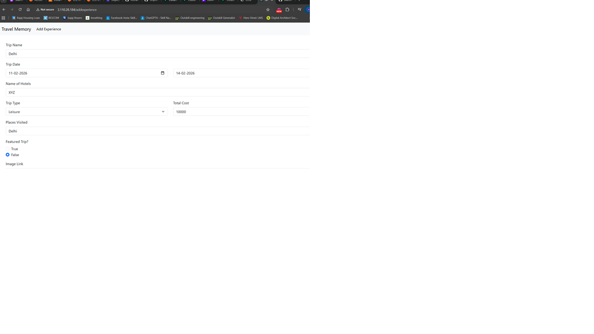
---

## 6. Create AMIs and Launch Additional Instances

Create:

* frontend AMI
* backend AMI

Launch:

* frontend-2
* backend-2

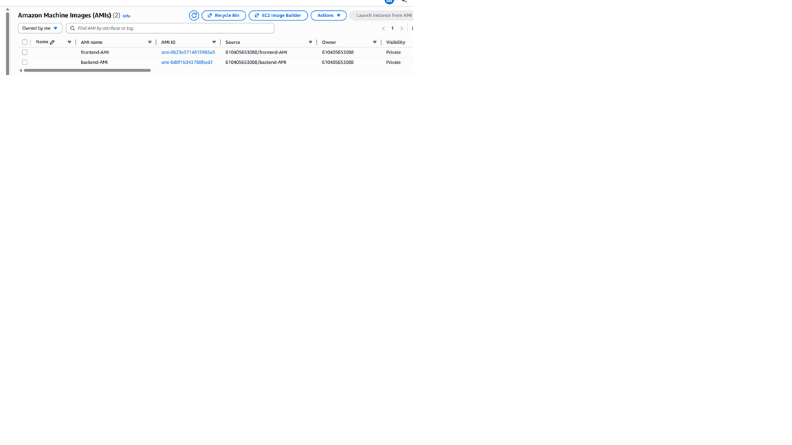


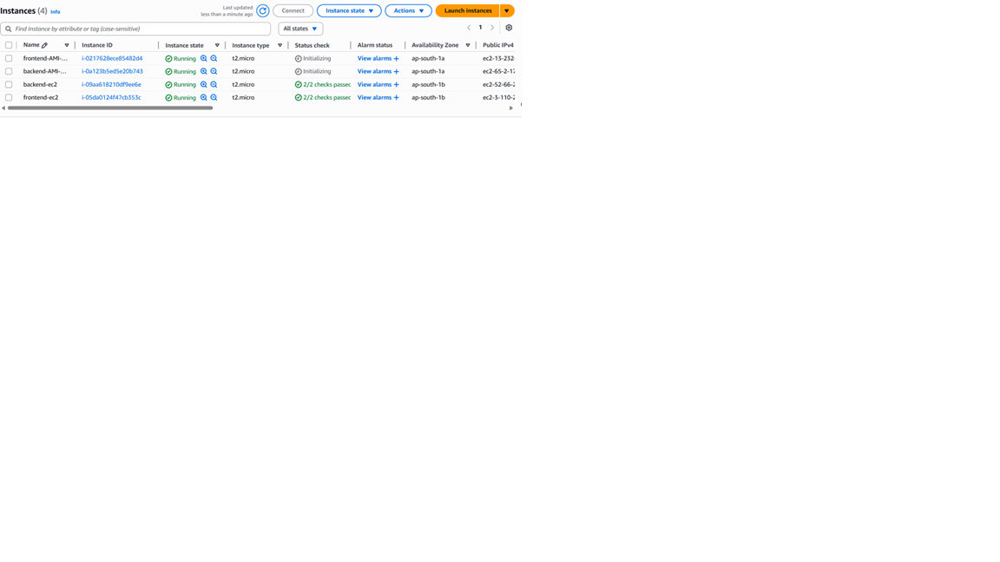

---

## 7. Create Target Groups

Frontend target group:

* HTTP
* Port 80
* Health check `/`

Backend target group:

* HTTP
* Port 3000
* Health check `/`

---

## 8. Create Application Load Balancers

Frontend ALB:

* Internet-facing
* Listener HTTP 80
* Target frontend TG

Backend ALB:

* Internet-facing
* Listener HTTP 80
* Target backend TG

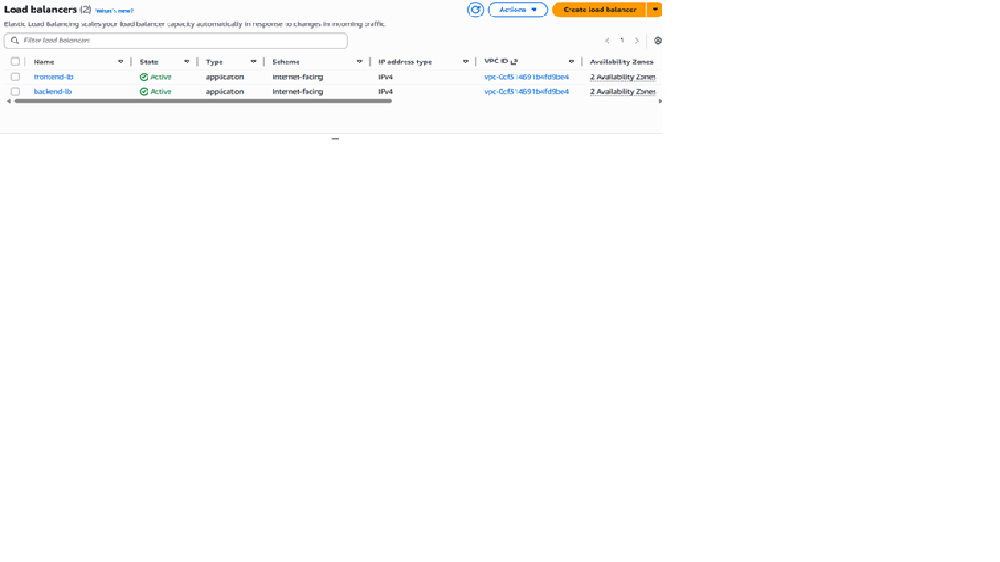

---

## 9. Configure Cloudflare DNS

| Type  | Name | Value            |
| ----- | ---- | ---------------- |
| CNAME | @    | FRONTEND_ALB_DNS |
| CNAME | api  | BACKEND_ALB_DNS  |

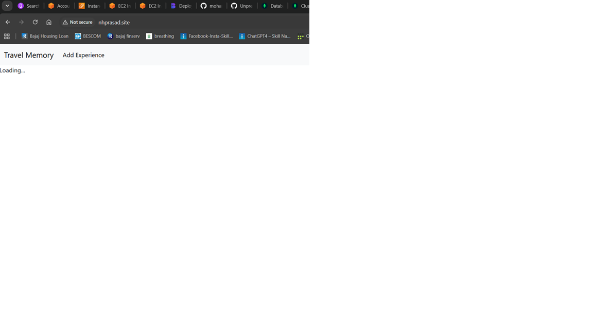

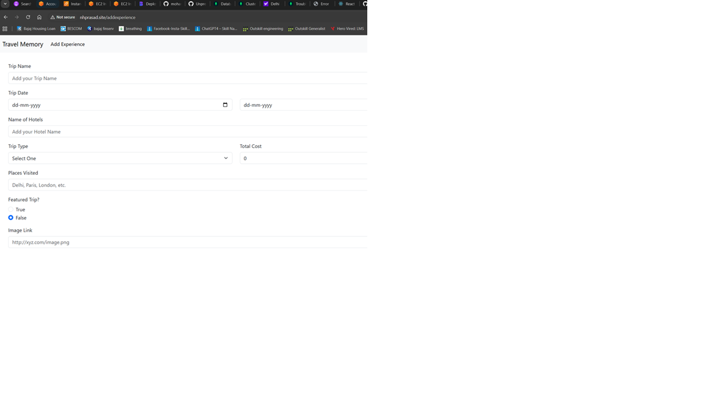

---

## 10. Configure SSL Using Certbot

```bash
sudo apt install certbot python3-certbot-nginx -y
sudo certbot --nginx -d yourdomain.com
sudo certbot --nginx -d api.yourdomain.com
sudo certbot renew --dry-run
```

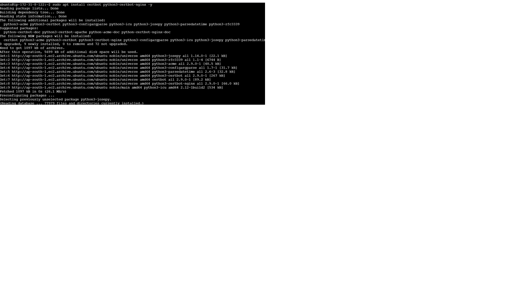

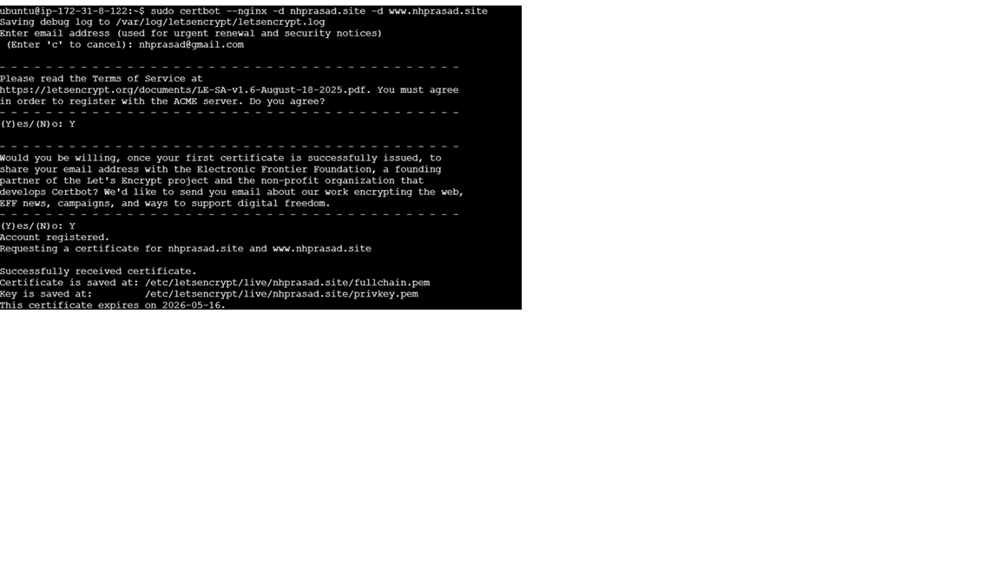

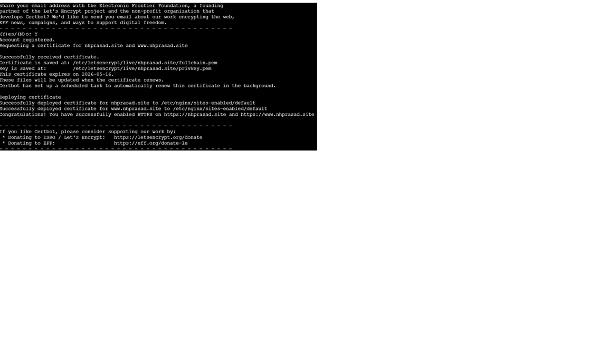

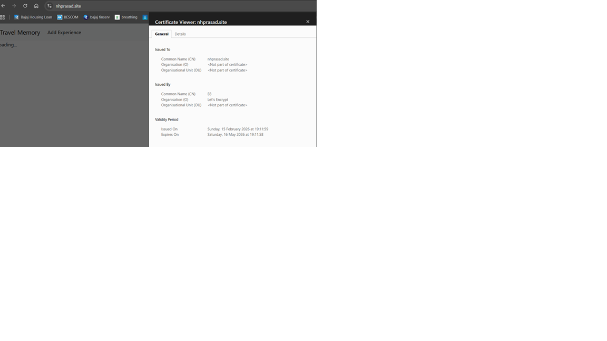

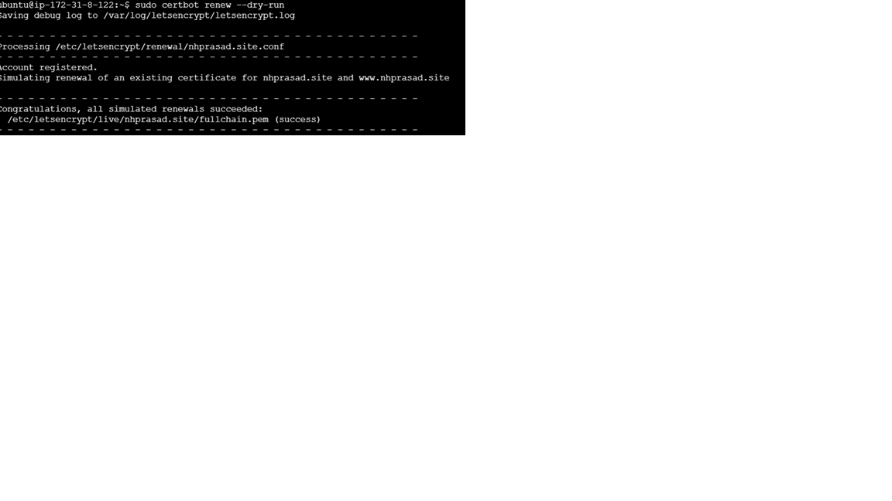

---

## Final Testing Checklist

* Backend running via PM2
* Frontend accessible
* Reverse proxy functioning
* Target groups healthy
* Load balancers reachable
* Domain resolving correctly
* HTTPS enabled

---

## Final Result

The Travel Memory application is successfully deployed with:

* Custom domain access
* Secure HTTPS connection
* Load-balanced frontend and backend
* Scalable infrastructure

---


# Travel Memory

`.env` file to work with the backend after creating a database in mongodb: 

```
MONGO_URI='ENTER_YOUR_URL'
PORT=3000
```

Data format to be added: 

```json
{
    "tripName": "Incredible India",
    "startDateOfJourney": "19-03-2022",
    "endDateOfJourney": "27-03-2022",
    "nameOfHotels":"Hotel Namaste, Backpackers Club",
    "placesVisited":"Delhi, Kolkata, Chennai, Mumbai",
    "totalCost": 800000,
    "tripType": "leisure",
    "experience": "Lorem Ipsum, Lorem Ipsum,Lorem Ipsum,Lorem Ipsum,Lorem Ipsum,Lorem Ipsum,Lorem Ipsum,Lorem Ipsum,Lorem Ipsum,Lorem Ipsum,Lorem Ipsum,Lorem Ipsum,Lorem Ipsum,Lorem Ipsum,Lorem Ipsum,Lorem Ipsum,Lorem Ipsum,Lorem Ipsum,Lorem Ipsum,Lorem Ipsum,Lorem Ipsum,Lorem Ipsum,Lorem Ipsum,Lorem Ipsum,Lorem Ipsum,Lorem Ipsum,Lorem Ipsum, ",
    "image": "https://t3.ftcdn.net/jpg/03/04/85/26/360_F_304852693_nSOn9KvUgafgvZ6wM0CNaULYUa7xXBkA.jpg",
    "shortDescription":"India is a wonderful country with rich culture and good people.",
    "featured": true
}
```


For frontend, you need to create `.env` file and put the following content (remember to change it based on your requirements):
```bash
REACT_APP_BACKEND_URL=http://localhost:3000
```
